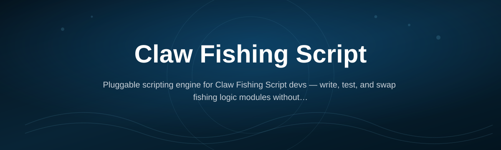
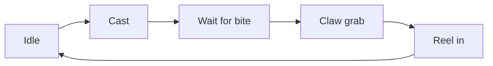

# claw-fishing-script-engine

*For people who'd rather automate the claw-and-cast grind than click the same button 400 times an hour.*

## What this is

Before anything else, here's what you're actually getting:

- **Auto-cast + auto-reel loop** that doesn't drift out of sync after ten minutes
- **Claw-grab timing tuned per rod tier** instead of one generic delay for everything
- **Idle-session recovery** so a lag spike doesn't leave your line hanging
- **Lightweight overlay** that shows what the engine is doing right now, not a black box

Claw Fishing Script is a standalone automation engine built for the claw-and-reel fishing loop found in Claw Fishing — the cast, wait, claw-grab, reel, repeat cycle that eats real playtime if you do it by hand. This engine handles that loop directly: it watches for the bite window, times the claw grab, and manages the reel-in without you babysitting every cast.

The second half of the problem — the part most "fishing scripts" ignore — is consistency. A script that works for five minutes and then desyncs after a lag spike or a rod switch isn't actually saving you time, it's just delaying frustration. This build was written around that failure mode specifically: state tracking that survives frame drops, rod-tier-aware timing instead of one-size-fits-all delays, and a visible status readout so you're not guessing whether it's still doing its job.

  

The button above opens the project landing page, where the current build is available to download.

## Who it is for

- Players grinding claw-fishing loops for gear or currency who don't want RSI as a side effect
- People who tried a generic "auto fisher" script and got tired of it missing every third catch
- Anyone running long AFK sessions who needs the loop to recover on its own after a disconnect or lag spike
- Tinkerers who want to see and adjust the timing values instead of trusting a black-box macro
- Streamers or testers who want a visible status overlay while the engine runs, not silent guesswork

## What you can do

- **Run a full cast-grab-reel loop unattended** for extended sessions without manual input
- **Tune claw-grab timing per rod** so upgrades actually behave differently instead of using one delay for all
- **Watch live status** through a small on-screen readout showing current loop state
- **Recover automatically** from short freezes, dropped frames, or brief disconnects mid-cast
- **Toggle the engine on/off with a hotkey** without closing or restarting anything
- **Adjust cast delay and reel speed** manually if the defaults don't match your setup
- **Log session activity** to a local file so you can see catch counts after a long run
- **Run standalone** — no extra runtime, no background service installed on your machine

## Getting started

1. Open the landing page using the download button above.
2. Download the current build for Windows.
3. Extract it to any folder you control — no installer, no forced directory.
4. Launch the executable and load Claw Fishing as you normally would.
5. Start the loop with the in-app hotkey once you're positioned to fish.

## Requirements

- Windows 10 or 11 (64-bit)
- No .NET SDK, Python, or build toolchain needed — it's a standalone executable
- A working install of Claw Fishing already set up and logged in
- Roughly 50 MB of free disk space

## How it works

The engine runs a short state machine on top of your existing game session rather than injecting anything into it — it watches screen state and timing, then sends the same inputs you would.

1. **Idle** — engine waits for the hotkey to arm the loop.
2. **Cast** — sends the cast input and starts a timer.
3. **Wait for bite** — polls for the bite signal instead of guessing a fixed delay.
4. **Claw grab** — times the grab window based on the rod tier you're using.
5. **Reel in** — completes the catch and loops back to idle for the next cast.

<strong>FAQ</strong>

**Is Claw Fishing Script safe to run alongside the game?**
It runs as a separate process and sends standard input events; it doesn't modify game files. That said, any automation carries some account risk depending on the game's own rules, so use your judgment.

**Does it work if I switch rods mid-session?**
Yes. Claw-grab timing is tied to rod tier detection, so switching rods adjusts the timing automatically instead of breaking the loop.

**Why did the loop stop reeling after a lag spike?**
Short freezes are handled by the recovery state, but very long stalls (10+ seconds) can push it past the timeout. Restart the loop with the hotkey if that happens.

**Can I run this on a laptop with an integrated GPU?**
Yes — the engine isn't rendering anything heavy, it's mostly timing and input logic, so it's light on hardware.

**Do I need to run it as administrator?**
Only if Claw Fishing itself requires elevated permissions to accept input from other processes. Otherwise, a normal launch works fine.

<strong>Troubleshooting</strong>

**The loop won't start when I press the hotkey.**
Confirm the game window is focused and not minimized — input targeting relies on the active window.

**Claw grabs are missing the timing window.**
Check that the correct rod tier is selected in the overlay; a mismatch here is the most common cause of missed grabs.

**Windows flags the executable on first run.**
This is typical for unsigned indie tools. Allow it through Windows Defender or your antivirus if you trust the source you downloaded from.

**The status overlay shows "disconnected" but the game is running fine.**
Restart the engine after the game has fully loaded — starting it before the game window exists can leave the overlay in a stale state.

## License

Released under the [MIT License](LICENSE). Use it at your own discretion — the project is provided as-is, with no warranty, and no guarantee about how any specific game handles automated input.

  

